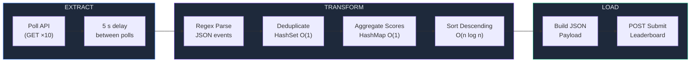

# Quiz Leaderboard ETL Pipeline

> **Registration Number:** `RA2311003020635`

A single-file Java solution for the Bajaj Finserv assignment. It polls a quiz API 10 times, cleans up duplicate events, tallies scores per participant, and POSTs the final leaderboard — **no Maven, no external libraries, just standard Java 11+.**

---

## How the pipeline flows



Three stages, each with a clear job:

- **Extract** — hits `GET /quiz/messages?regNo=...&poll={0–9}` ten times, with a mandatory 5-second wait between each call.
- **Transform** — parses the JSON response with regex, drops duplicates using a `HashSet`, and adds up scores per participant in a `HashMap`. Then sorts the result descending by total score.
- **Load** — hand-builds the JSON payload and POSTs it to `/quiz/submit`.

---

## Running it

```bash
# Compile
javac Main.java

# Run
java Main
```

No `pom.xml`. No Gradle wrapper. Just two commands.

---

## What each method does

| Method | Stage | What it does |
|--------|-------|--------------|
| `fetchPollData()` | Extract | Makes the GET request, checks status code, passes body downstream |
| `processAndDeduplicate()` | Transform | Runs the regex, checks the `HashSet`, updates the `HashMap` |
| `buildSortedLeaderboard()` | Transform | Converts the map to a sorted list of `PlayerScore` objects |
| `submitResults()` | Load | Builds the JSON string and POSTs it |
| `buildSubmitJson()` | Load | Constructs the payload manually — no serialization library needed |
| `escapeJson()` | Utility | Handles `"`, `\`, newlines, etc. per RFC 8259 |
| `sleep()` | Utility | Wraps `Thread.sleep()` with proper interrupt handling |

---

## Why I made these specific choices

### `java.net.http.HttpClient` instead of OkHttp / Apache

I didn't want to pull in a dependency just to make a few GET/POST calls. `HttpClient` ships with Java 11+ and does everything I need — connection timeouts, response body as a string, POST with a body. The table below explains the trade-off:

| | `java.net.http` | OkHttp / Apache |
|--|--|--|
| Setup | No extra steps | Needs Maven or manual JAR |
| Size added | 0 KB | ~2–4 MB |
| Maintenance | Covered by JDK LTS | Separate version tracking |

For a focused assignment like this, adding a build tool just for HTTP would be overkill.

### Regex instead of Jackson / Gson

The API response has a fixed, predictable structure. Three capture groups are enough to pull out `roundId`, `participant`, and `score` in one pass through the string:

```java
"roundId"\s*:\s*"([^"]+)"\s*,\s*"participant"\s*:\s*"([^"]+)"\s*,\s*"score"\s*:\s*(\d+)
```

The `Pattern` is compiled once as a `static final` field — so there's no repeated compilation cost across all 10 polls.

> Fair caveat: regex-based JSON parsing breaks if the schema changes. It's fine here because I control nothing about the server — the format is fixed and given.

### `java.util.logging.Logger` instead of `System.out`

`System.out` has no log levels. With `Logger`, I can log `INFO` for normal flow, `WARNING` for 4xx/5xx responses, and `SEVERE` for exceptions — which makes it much easier to see what's happening at a glance when the program is running.

---

## Time & Space Complexity

Let:
- `P` = polls (always 10)
- `E` = total events seen across all polls
- `U` = unique events after deduplication
- `K` = unique participants

| Operation | Time | Space | Notes |
|-----------|------|-------|-------|
| HTTP polling | `O(P)` | `O(1)` | Fixed number of sequential requests |
| Regex extraction | `O(E)` | `O(1)` | Single-pass matcher per response body |
| Deduplication (`HashSet.add`) | `O(1)` per event | `O(U)` | Composite key: `roundId\|participant` |
| Score aggregation (`HashMap.merge`) | `O(1)` per event | `O(K)` | One entry per participant |
| Sort | `O(K log K)` | `O(K)` | Java's TimSort |
| JSON serialisation | `O(K)` | `O(K)` | Linear scan of sorted list |
| **Total** | **`O(E + K log K)`** | **`O(U + K)`** | Dominated by extraction + sort |

In practice, `K` (participants) is much smaller than `E` (total events), so the whole thing is effectively linear.

---

## Code structure at a glance

```
Main.java
├── Constants (REG_NO, URLs, timeouts)
├── Logger setup
├── PlayerScore  — inner class, holds participant + totalScore, sorts descending
└── main()
    ├── fetchPollData()        → Extract
    ├── processAndDeduplicate() → Transform
    ├── buildSortedLeaderboard() → Transform
    └── submitResults()        → Load
        ├── buildSubmitJson()
        └── escapeJson()
```

---

## Suggested commit history

If you're pushing this to GitHub and want the history to look like actual incremental development:

| # | Message | What it covers |
|---|---------|----------------|
| 1 | `feat: scaffold project with constants and domain model` | `REG_NO`, URLs, `PlayerScore` class, empty `main()` |
| 2 | `feat: implement polling and regex-based event extraction` | `fetchPollData()`, `EVENT_PATTERN`, HTTP client setup |
| 3 | `feat: add deduplication and score aggregation` | `processAndDeduplicate()`, `HashSet`/`HashMap` logic |
| 4 | `feat: implement JSON serialisation and submission` | `buildSubmitJson()`, `escapeJson()`, `submitResults()` |
| 5 | `docs: add README with architecture notes and complexity analysis` | `README.md` |

## Sample Execution Output

Below is a trace of a successful run, demonstrating the 5-second polling delay, real-time deduplication, and the final server validation.

```text
INFO: ETL Pipeline started | regNo=RA2311003020635
INFO: [POLL 0] → GET [https://devapigw.vidalhealthtpa.com/srm-quiz-task/quiz/messages?regNo=RA2311003020632&poll=0](https://devapigw.vidalhealthtpa.com/srm-quiz-task/quiz/messages?regNo=RA2311003020632&poll=0)
INFO: [POLL 0] << new=2  dup=0
... (5 second delay) ...
INFO: [POLL 4] → GET [https://devapigw.vidalhealthtpa.com/srm-quiz-task/quiz/messages?regNo=RA2311003020632&poll=4](https://devapigw.vidalhealthtpa.com/srm-quiz-task/quiz/messages?regNo=RA2311003020632&poll=4)
INFO: [POLL 4] << new=1  dup=1  (Duplicate intercepted)
... (5 second delay) ...
INFO: [POLL 8] → GET [https://devapigw.vidalhealthtpa.com/srm-quiz-task/quiz/messages?regNo=RA2311003020632&poll=8](https://devapigw.vidalhealthtpa.com/srm-quiz-task/quiz/messages?regNo=RA2311003020632&poll=8)
INFO: [POLL 8] << new=0  dup=2  (Duplicates intercepted)
...
INFO: Leaderboard assembled | participants=3 | uniqueEvents=10
INFO: Submitting payload (209 bytes) → POST [https://devapigw.vidalhealthtpa.com/srm-quiz-task/quiz/submit](https://devapigw.vidalhealthtpa.com/srm-quiz-task/quiz/submit)

Payload:
{
  "regNo": "RA2311003020632",
  "leaderboard": [
    { "participant": "George", "totalScore": 795 },
    { "participant": "Hannah", "totalScore": 750 },
    { "participant": "Ivan", "totalScore": 745 }
  ]
}

INFO: Submission response [HTTP 200]:
{"regNo":"RA2311003020632","totalPollsMade":18,"submittedTotal":2290,"attemptCount":2}
INFO: ETL Pipeline completed.
